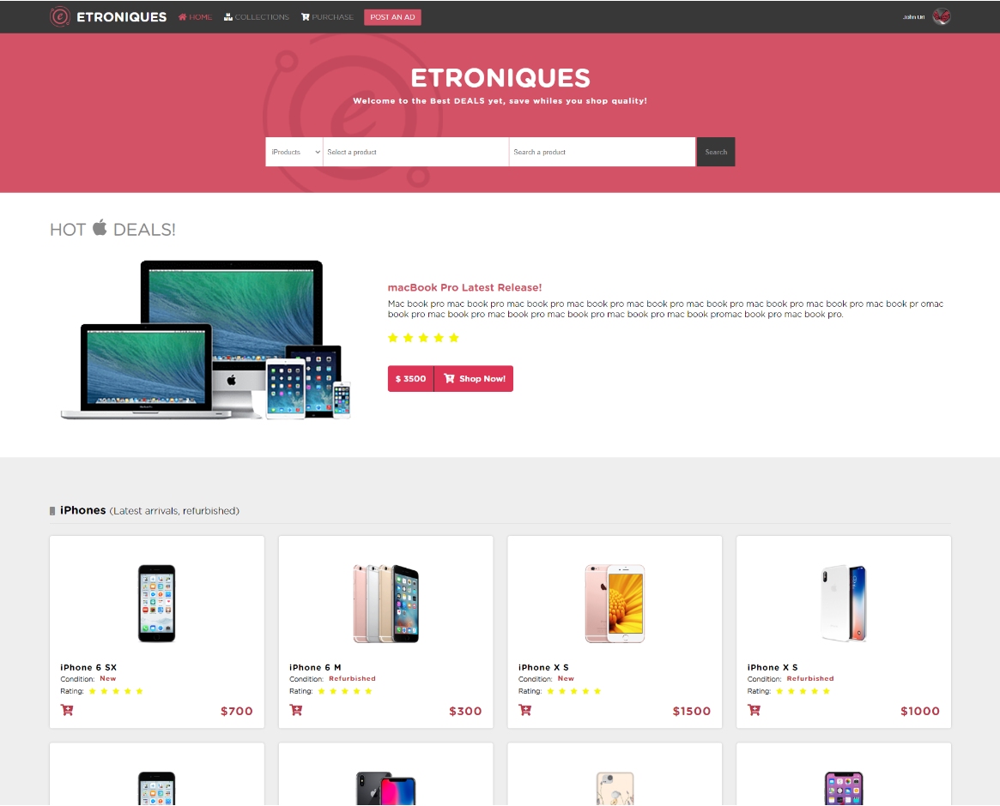
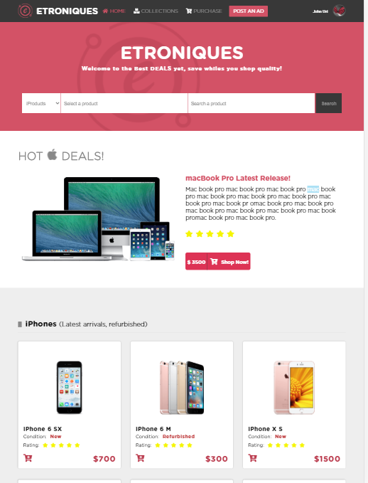
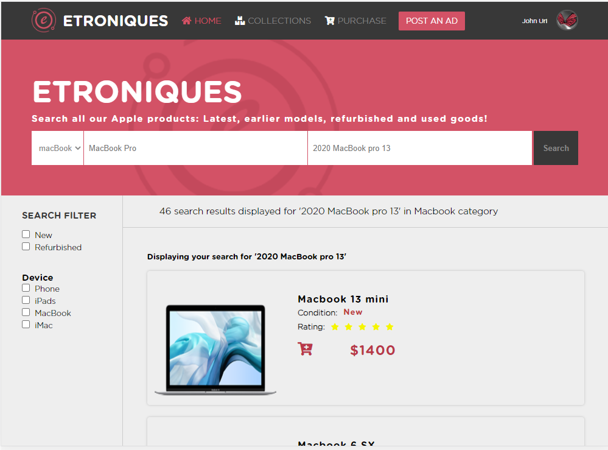

# HTML & CSS capstone project: Online shop for electronics
 > This project constitutes first capstone project, using HTML/ CSS and/ or other frameworks to build building responsive websites.

## Live Demo

[Live Demo Link](https://wizardly-stonebraker-3f717e.netlify.app/)

## Getting Started

To get a local copy up and running follow these steps:

- Download this repository and open the zip file to a location of your choosing.
- Open the index.html file in your browser of preference.

### Prerequisites

Congratulations. If you're viewing this README.md file on a browser, via the internet, with a working computer, you are in possession of the pre-requisites to enjoy our work.

## Authors

👤 **Robert Loterh**

- Github: [@rloterh](https://github.com/rloterh)
- Twitter: [@RLoterh](https://twitter.com/RLoterh)
- Linkedin: [Robert Loterh](https://www.linkedin.com/in/robert-loterh-30b265135)
- Email: rloterh@gmail.com

## 🤝 Contributing

The most valuable contribution you can make is honest feedback!

Let us know what you think of our work by getting in touch via social media or by creating an issue here on GitHub.

Also see a walkthrough of the project here:[Video Recording](https://www.loom.com/share/fe9b5deff8394be7b9047310ea6fb00fx)

## Show your support

Give a ⭐️ if you like this project! Follow us and be the first to know about our next project!

## Acknowledgments

- Thanks to [Mohammed Awad](https://www.behance.net/M_Awad) as designer of this layout.
- Thanks to our Microverse Stand-Up Team for reviewing our code and providing constructive feedback.

## 📝 License

This project is [MIT](lic.url) licensed.

